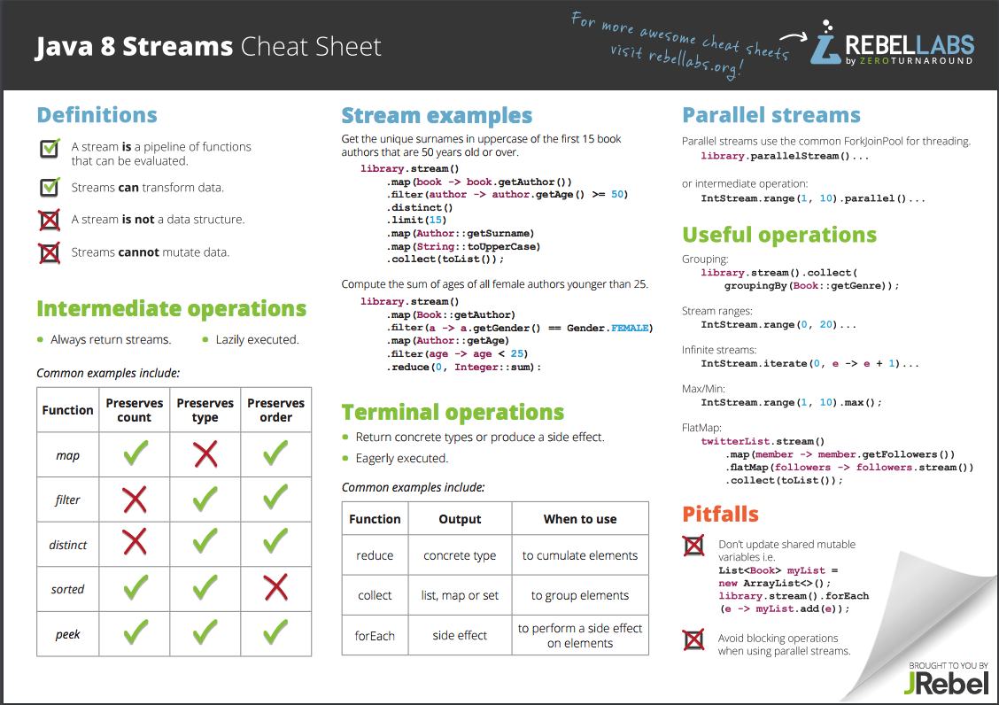

Main features in java 8

 http://www.oracle.com/technetwork/java/javase/8-whats-new-2157071.html
 https://www.youtube.com/playlist?list=PLsyeobzWxl7qbvNnJKjYbkTLn2w3eRy1Q
 https://zeroturnaround.com/rebellabs/java-8-streams-cheat-sheet/
 http://winterbe.com/posts/2014/07/31/java8-stream-tutorial-examples/
 
1. forEach() method in Iterable interface
2. default and static methods in Interfaces
3. Functional Interfaces and Lambda Expressions
   http://www.baeldung.com/java-8-functional-interfaces
 - Functional Interface is an interface with only one abstract method
   regardless of whether or not a FunctionalInterface annotation is present on the interface declaration.
   for example: Runnable, Comparable
  Main interfaces :
  - Optional : wrap to avoid null pointer
  - Predicate : one or more than one arguments and return boolean
  - Function<T,R> : accept one argument and produces a result R
  - Consumer: accepts one more than one arguments and return void
  - Operator: argument and return are same type
4. Java Stream API for Bulk Data Operations on Collections
   
5. Java Time API
6. Collection API improvements
7. Concurrency API improvements
   http://winterbe.com/posts/2015/04/07/java8-concurrency-tutorial-thread-executor-examples/
8. Java IO improvements
10. Miscellaneous Core API improvements
