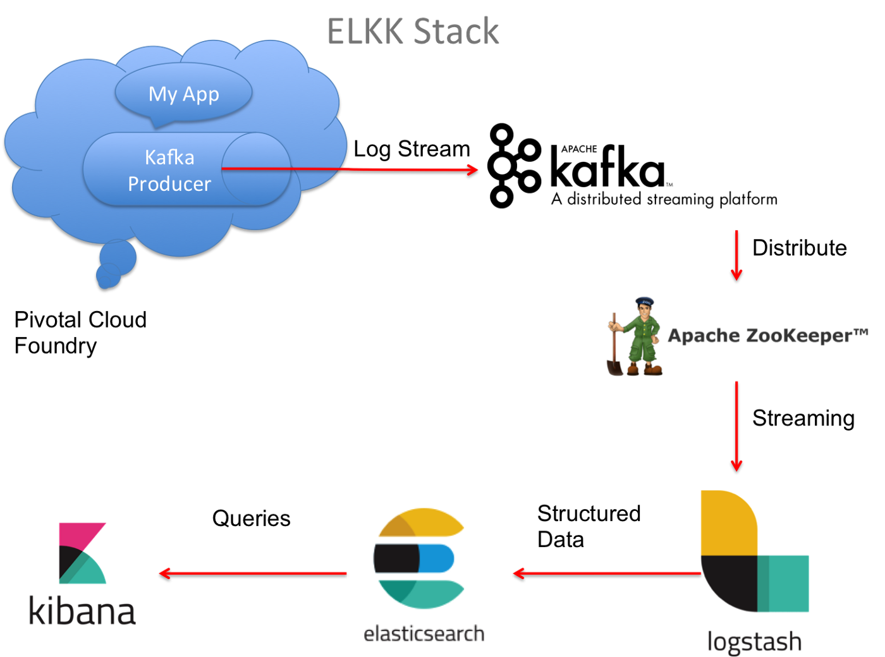

MicroService

1. Tech stack.
  
  
  
   - Spring Cloud : spring eureka discovery/registry, feign, hytrix, dashboard, spring config, spring auth services and security.
   - Apache kafka
   - ELK (elasticsearch, logstask, kibana) for centralized logging
   - Docker

2. How to install.

  2.1 Install Elasticsearch
  https://www.elastic.co/guide/en/elasticsearch/reference/current/docker.html

      healthcheck api:
      curl -XGET http://localhost:9200/_cluster/health?pretty=true

  2.2 Install kibana and config
  https://www.elastic.co/guide/en/kibana/current/settings.html

  2.3 Install logstash

  folder structure
  https://www.elastic.co/guide/en/logstash/current/dir-layout.html
