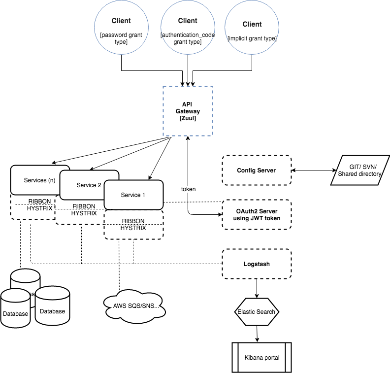

## Micro Services

### 1. Tech stack.
  

   -  Spring Cloud : spring eureka discovery/registry, feign, hytrix, dashboard, spring cloud config
   -  Spring security, oauth2 using JWT.
   -  Apache kafka
   -  ELK (elasticsearch, logstask, kibana) for centralized logging
   -  Docker

### 2. How to run
  - #### 2.1 Run `config`
  - #### 2.2 Run `registry` with parameters
    -Dapp.name=registry -Dapp.log.path=/Users/linhpham/logs/cl -DEUREKA_SERVER=http://localhost:8082 -DCONFIG_SERVER=http://localhost:8081

  - #### 2.3 Run `auth` with parameters
    -Dapp.name=auth -Dapp.log.path=/Users/linhpham/logs/cl -DEUREKA_SERVER=http://localhost:8082 -DCONFIG_SERVER=http://localhost:8081

  - #### 2.4 Run `account` with parameters
   -Dapp.name=account -Dapp.log.path=/Users/linhpham/logs/cl -DEUREKA_SERVER=http://localhost:8082 -DCONFIG_SERVER=http://localhost:8081

### 3. How to test
 - #### 3.1 Sign up new User Profile
   trigger /postman/signup
 - #### 3.2 Login by 2 options
    - Login via clientapp using `authentication_code`
      
    - Login directly to authserver using `password` grant type
      - trigger /postman/login_password_granttype
 - #### 3.3 get User Profile
    trigger /postman/get_userprofile

### 4. Tech Summary

#### 4.1 oAuth2 :

 Detail Specification:
 * https://tools.ietf.org/html/rfc6749
 * https://auth0.com/docs/api-auth/which-oauth-flow-to-use

 #### Main components:
  - auth server
  - resource server
  - resource owner (user)
  - resource's user-agent(browser)
  - client application ( trusted application + untrusted html, javascript application )

 #### Grant type
  - authorization_code:
  - implicit
  - password
  - client_credential

### 5. Install sub-modules.
  #### 5.1 Install Elasticsearch
  https://www.elastic.co/guide/en/elasticsearch/reference/current/docker.html

      healthcheck api:
      curl -XGET http://localhost:9200/_cluster/health?pretty=true

  #### 5.2 Install kibana and config
  https://www.elastic.co/guide/en/kibana/current/settings.html

  #### 5.3 Install logstash

  folder structure
  https://www.elastic.co/guide/en/logstash/current/dir-layout.html
