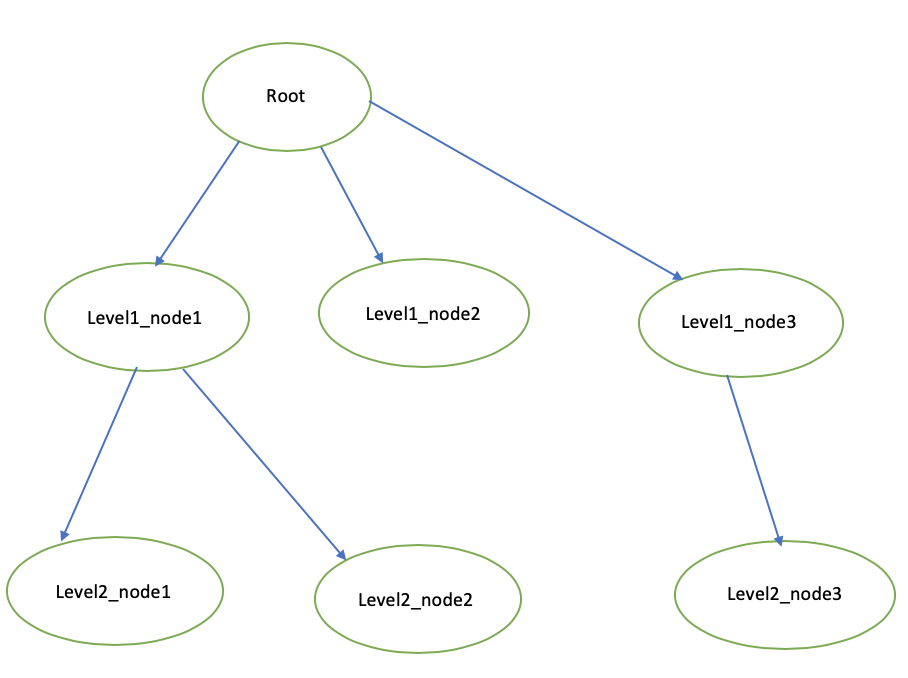

** This program is running on JDK 8 **
Download sp.zip and extract to local as java project and run.

## Question 1

### solution:
	- find list of plan for each selected feature.
	- find the cheapest plan in each plan list. the new field replicas in Plan class to check how many times one plan is counted in case selected features are in the same plan then sort plans by cost/replicas.
	- put a cheapest plan for each selected feature together and remove duplicated plan.

### how to run: 
    - test data is in question1_data.json
    - user can pass selected feature from input params or change directly String[] selectedFeatures in question1.Main.java 
    - run program as normal java application.

## Question 2

### solution:

    - Traverse from root and each node will be registered into List<NavigableMap<Integer, Node>> to identify level  and index in each level. List index is level index,  NavigableMap key is index of node in each level, sorted by natural order.  
    - when one node is inserted into List<NavigableMap<Integer, Node>>, this node is able to find out which node is on the left using lastEntry function in NavigableMap, and link together.

### how to run: 
 
  
  
   
	- run program as normal java application.
	and Result will be printed below:   

	|  Node  'root' doesn't have right node.  |
	|  Node  'level1_node1' has right node 'level1_node2'.  |
	|  Node  'level2_node1' has right node 'level2_node2'.  |
	|  Node  'level2_node2' has right node 'level2_node3'  |
	|  Node  'level1_node2' has right node 'level1_node3'  |
	|  Node  'level1_node3' doesn't have right node.  |
	|  Node  'level2_node3' doesn't have right node.  |